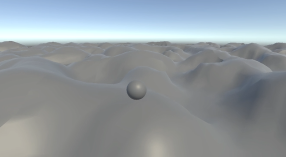

# Procedural Terrain Generator

An optimized and modular procedural terrain generation system designed for real-time rendering in Unity. This project implements a quad tree algorithm to efficiently generate large-scale terrain using a viewer-dependent level of detail system.

## Click for Demo! (Current state)
[](https://drive.google.com/file/d/1HJoDGvHuP5sSsanhOqNad1f8N15f4TQM/view?usp=drive_link)

## Features
- **Quad Tree-Based LOD**: Dynamically subdivides terrain based on the viewer's field of view for optimal performance.
- **Efficient Culling**: Uses a triangle-based FOV intersection test to limit unnecessary subdivisions.
- **Seamless Streaming**: Loads and unloads terrain chunks dynamically to support vast, explorable environments.
- **Customizable Noise Functions**: Supports various noise-based terrain generation methods (Perlin noise, Simplex noise, etc.).
- **Shader-Based Rendering** (Planned): Optimized shaders for terrain visualization with dynamic tessellation.
- **Multiplayer Ready** (Planned): Future support for synchronizing procedural terrain across networked players.

## Installation
1. Clone the repository:
   ```sh
   git clone https://github.com/tommiedizon/Terrain-Proc-Gen.git
   ```
2. Open the project in Unity (version 2023.x or later recommended).
3. Run the scene to see the procedural generation in action.

## How It Works
1. **Quad Tree Construction**:
   - The world is divided into large square nodes.
   - Each node is recursively subdivided if it falls within the viewer's FOV and is below a certain size threshold.
2. **Viewer-Based LOD**:
   - Nodes close to the viewer are more detailed, while distant ones merge into larger chunks.
   - Uses a triangle-based intersection check with the view frustrum to determine which nodes should be subdivided.
3. **Procedural Terrain Generation**:
   - Heights are determined using customizable noise functions (currently Perlin).
   - Terrain data is generated asynchronously to avoid performance hiccups.

## Planned Features
- **Customer Shaders**: Adding realistic textures and animations using Shaders
- **Biome Generation**: Varying terrain styles based on climate zones.
- **Multiplayer Synchronization**: Ensure terrain consistency across players.
- **Object Placement**: Procedural spawning of trees, rocks, and structures.
- **Dynamic Weather & Erosion**: Simulate environmental changes over time.

## Contact
For questions, reach out via GitHub Issues or contact me @ thomasjdizon@gmail.com
