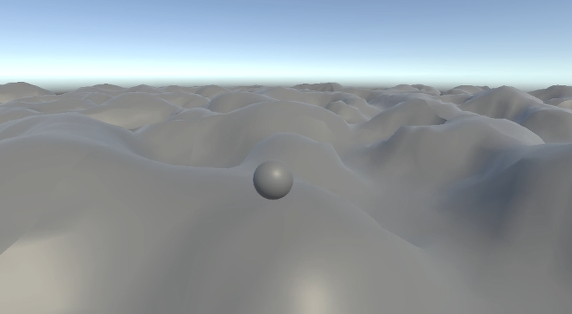
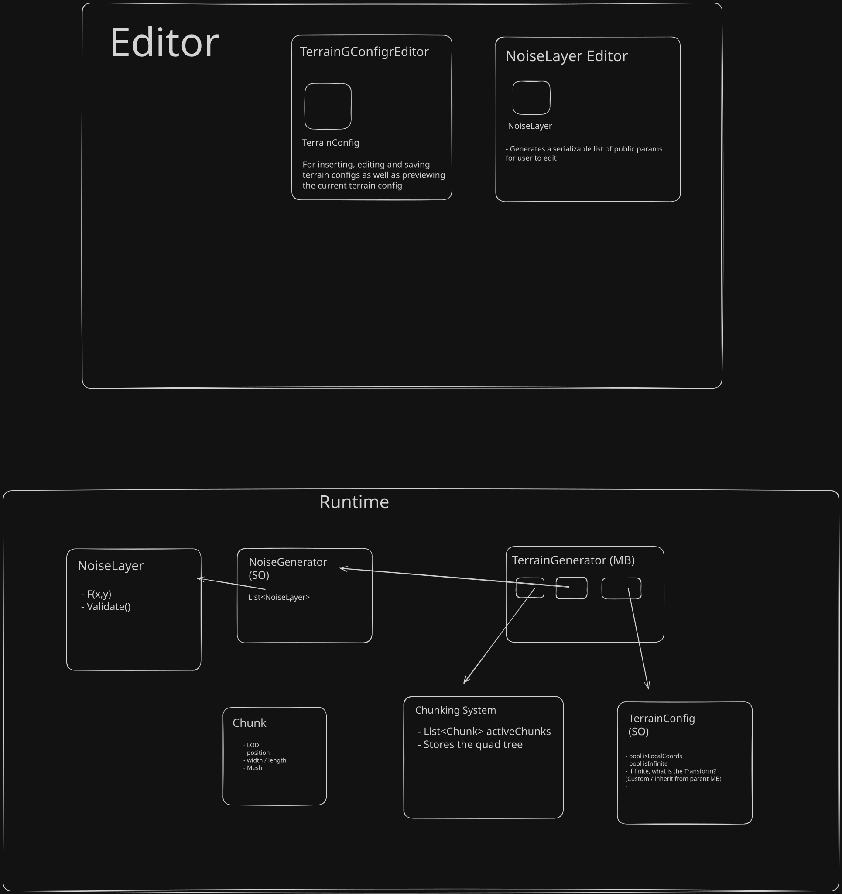

# Procedural Terrain Generator

An optimized and modular procedural terrain generation system designed for real-time rendering in Unity. This project implements a quad tree algorithm to efficiently generate large-scale terrain using a viewer-dependent level of detail system.
## Features
- **Quad Tree-Based LOD**: Dynamically subdivides terrain based on the viewer's field of view for optimal performance.
- **Advanced Chunking System**: Uses memory efficient data structures & algorithms to manage chunking
- **Multithreaded** (Planned): Optimise further through multithreading
- **Stylized through custom shaders** (Planned): Add terrain textures and other stylistic features to make it look nice

## System Diagram

